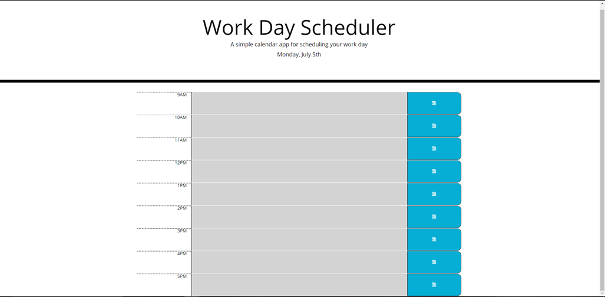
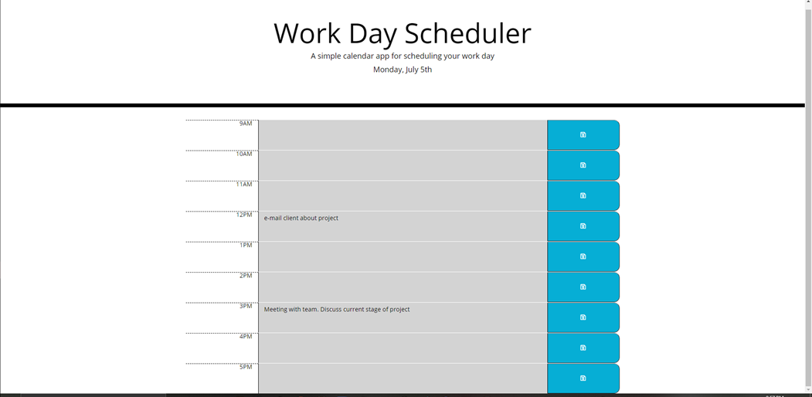

# HW5-Day-Planner-Pasgen-Manley

## Link to application

### Project Description
The project was to develop a day planner application. This application was to have the standard office hours (9-5) separated into columns for each hour. In each column, the user could input text which they can save upon refresh. The time blocks color is reactive to the time of day. If it is the current hour the time block appears as red, if it is in the past it appears as grey and finally, the future time blocks are green.

#### Application screen example

How the day planner appears when first opening the application.

How the application looks when events are added and saved.

